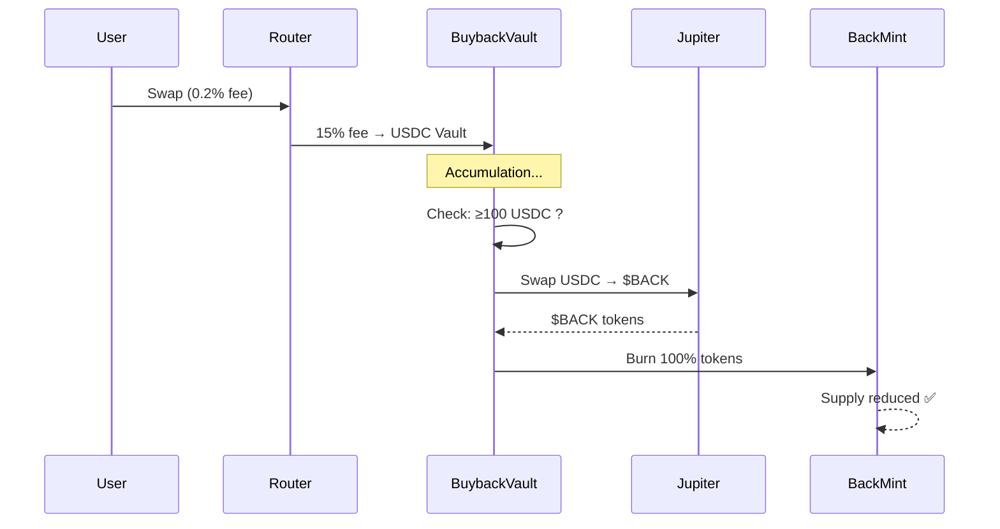

# Guide Utilisateur - Système Buyback 100% Burn

**SwapBack DEX Aggregator - Modèle Déflationniste**  
_Mis à jour le 24 novembre 2025_

---

## 🔥 Qu'est-ce que le Buyback 100% Burn ?

Le système de **buyback 100% burn** est un mécanisme déflationniste qui réduit progressivement la supply totale du token $BACK, créant une pression haussière sur le prix au bénéfice de **tous les holders**.

### Fonctionnement en 3 étapes :

```
1. ACCUMULATION
   ├─ 15% des frais platform (0.2%) → USDC Vault
   └─ Accumulation continue jusqu'à atteindre 100 USDC minimum

2. BUYBACK
   ├─ USDC → Swap Jupiter → $BACK tokens
   └─ Meilleur prix garanti via routage Jupiter

3. BURN 100%
   ├─ 100% des tokens achetés sont BRÛLÉS
   ├─ Supply totale diminue définitivement
   └─ Tous les holders bénéficient (prix ↑)
```

---

## 💡 Pourquoi 100% Burn (et non 50/50) ?

### ✅ Avantages du modèle 100% Burn

| Aspect | Ancien modèle (50/50) | Nouveau modèle (100% Burn) |
|--------|----------------------|---------------------------|
| **Simplicité** | Distribution complexe aux holders | Burn direct, pas de claim |
| **Équité** | Avantage aux gros holders | **Tous holders bénéficient équitablement** |
| **Gas fees** | Coût élevé (distribution) | Coût minimal (1 burn) |
| **Déflation** | 50% burn seulement | **100% burn maximum** |
| **Prix** | Pression modérée | **Pression maximale** |

### 📈 Impact sur le prix

**Exemple avec 10,000 $BACK achetés :**

- **Ancien modèle (50/50)** :
  - 5,000 $BACK distribués → Holders peuvent vendre
  - 5,000 $BACK burn → Supply réduite de 0.0005%
  - Pression haussière : **Modérée**

- **Nouveau modèle (100% Burn)** :
  - 0 $BACK distribués → Aucune vente
  - 10,000 $BACK burn → Supply réduite de 0.001%
  - Pression haussière : **MAXIMALE** 🚀

---

## 🔢 Allocation des Revenus

### Frais Platform (0.2% sur chaque swap)

```
100 USDC de frais générés
├─ 85 USDC (85%) → Protocol Treasury
│  └─ Développement, marketing, opérations
│
└─ 15 USDC (15%) → Buyback Vault
   └─ Accumulation pour buyback périodique
```

### NPI - Net Positive Impact (gains de routage)

```
100 USDC de gains NPI (vs Jupiter)
├─ 70 USDC (70%) → Rebates Utilisateurs
│  └─ Cashback direct proportionnel au volume
│
├─ 15 USDC (15%) → Protocol Treasury
│  └─ Revenus additionnels protocole
│
└─ 15 USDC (15%) → Boost Vault
   └─ Récompenses pour holders lockés (Phase 6)
```

---

## 📊 Métriques Clés

### Visualisation du Dashboard

Le dashboard `/buyback` affiche en temps réel :

#### 1. **Statistiques Globales**
- 💰 **USDC accumulé** : Montant actuel dans le vault
- 🔥 **Total $BACK brûlé** : Cumul depuis le début
- 📊 **Nombre de buybacks** : Compteur d'exécutions
- 📅 **Dernier buyback** : Date et heure

#### 2. **Graphique Supply**
- Supply totale au fil du temps
- Courbe descendante (déflationniste)
- Jalons de burn

#### 3. **Buybacks Récents**
- Liste des 10 derniers buybacks
- Montants USDC dépensés
- Quantité $BACK brûlée
- Liens explorateur Solana

#### 4. **Visualisation Burn** 🔥
- Animation flammes proportionnelle au burn
- Pourcentage de supply réduite
- Impact prix estimé

---

## 🎯 Conditions d'Exécution

### Déclenchement automatique

Un buyback s'exécute **automatiquement** quand :

```
✅ USDC Vault ≥ 100 USDC (minimum)
✅ Temps écoulé ≥ 1 heure (cooldown)
✅ Liquidité Jupiter suffisante
```

### Processus technique



---

## 🔐 Sécurité & Transparence

### Audibilité

- ✅ **Code open-source** : Vérifiable sur GitHub
- ✅ **On-chain 100%** : Toutes transactions publiques
- ✅ **Explorer Solana** : Chaque burn traçable
- ✅ **Supply vérifiable** : `spl-token supply <BACK_MINT>`

### Adresses Clés (Devnet)

```
Token $BACK         : 862PQyzjqhN4ztaqLC4kozwZCUTug7DRz1oyiuQYn7Ux
Buyback Program     : 7wCCwRXxWvMY2DJDRrnhFg3b8jVPb5vVPxLH5YAGL6eJ
Router Program      : 9ttege5TrSQzHbYFSuTPLAS16NYTUPRuVpkyEwVFD2Fh
USDC Vault (PDA)    : 8rCyi7Bu6eTFZrJ5VvAQV8FHWz7kLCCEJyXKcdCSHH2Y
BACK Vault ATA      : 5oLYee2wgD9S5LKgEKtG8Q23hhBmGXeQ58SbKY7Kgv4S
```

### Vérifier un Burn

```bash
# Terminal
solana account <TRANSACTION_SIGNATURE> --url devnet

# Rechercher dans les logs :
# "Program log: Instruction: Burn"
# "Token balance decreased"
```

---

## 📈 Projections & Impact

### Scénario Exemple

**Hypothèses :**
- Volume quotidien : $1,000,000
- Frais platform 0.2% : $2,000
- 15% vers buyback : $300
- Prix $BACK : $0.10
- Buyback quotidien : 3,000 $BACK

**Résultats sur 1 an :**

| Période | Supply Initiale | Burn Cumulé | Supply Finale | Réduction |
|---------|----------------|-------------|---------------|-----------|
| Jour 1  | 1,001,000,000  | 3,000       | 1,000,997,000 | 0.0003%   |
| Mois 1  | 1,001,000,000  | 90,000      | 1,000,910,000 | 0.009%    |
| An 1    | 1,001,000,000  | 1,095,000   | 999,905,000   | **0.11%** |

**Impact prix estimé** (offre/demande) : **+0.11% à +0.22%**  
_Note : Impact réel dépend de la liquidité et de la demande_

---

## ❓ FAQ

### Q1 : Quand le prochain buyback ?
**R :** Automatique dès que USDC Vault ≥ 100 USDC ET 1h écoulée. Consultez le dashboard `/buyback` pour l'état actuel.

### Q2 : Comment je profite du burn ?
**R :** En **holdant** $BACK. Chaque burn réduit la supply → augmente la rareté → pression haussière sur le prix.

### Q3 : Y a-t-il un risque de manipulation ?
**R :** Non. Le système est :
- Automatisé (pas d'intervention humaine)
- On-chain (transparent)
- Auditeur externe (sécurité)

### Q4 : Puis-je "claim" des tokens brûlés ?
**R :** Non, c'est justement l'avantage ! Pas de claim = pas de gas fees = simplicité maximale. Vous profitez automatiquement via l'appréciation du prix.

### Q5 : Puis-je forcer un buyback ?
**R :** Non, pour éviter les manipulations. Le système s'exécute automatiquement selon les conditions définies (≥100 USDC, ≥1h).

### Q6 : Où voir l'historique des burns ?
**R :** Dashboard `/buyback` → Section "Buybacks Récents" ou Explorer Solana avec l'adresse du programme.

---

## 🚀 Prochaines Évolutions

### Phase 6 : Lock & Boost (En développement)

- 🔒 **Lock $BACK** : 30/60/90/180 jours
- 🎁 **Boost multipliers** : +10% à +50% sur rebates
- 🪙 **cNFT Receipt** : Preuve de lock avec tiers visuels
- 💰 **Boost Vault** : 15% du NPI distribué aux lockés

### Phase 7+ : Fonctionnalités Avancées

- 📊 Analytics avancées (volume, TVL, APY)
- 🎮 Gamification (leaderboards, badges)
- 🌐 Multi-chain (Ethereum, Polygon)
- 🤖 Trading bots (API/SDK)

---

## 💬 Support & Communauté

- 📖 **Documentation** : docs.swapback.io
- 🐦 **Twitter/X** : @SwapBackDEX
- 💬 **Discord** : discord.gg/swapback
- 📧 **Email** : support@swapback.io

---

**🔥 Plus vous swappez, plus on brûle. Plus on brûle, plus $BACK devient rare. Plus c'est rare, plus ça prend de la valeur. HODL & Swap ! 🚀**

