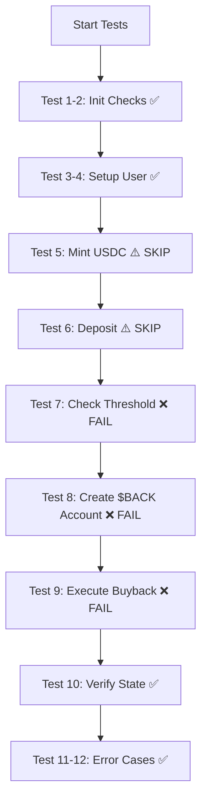

# 📊 Rapport de Tests E2E - Buyback System

**Date**: 31 Octobre 2025  
**Environnement**: Devnet Solana  
**Programme ID**: `92znK8METYTFW5dGDJUnHUMqubVGnPBTyjZ4HzjWQzir`

---

## 📈 Résultats Globaux

| Statut | Tests Passés | Tests Échoués | Total |
|--------|-------------|---------------|--------|
| ⚠️ PARTIEL | 9 / 12 | 3 / 12 | 12 |

**Taux de Réussite**: 75% (9/12 tests passés)

---

## ✅ Tests Réussis (9/12)

### 1. ✅ Buyback state is initialized
- **Résultat**: PASS ✓
- **Durée**: 365ms
- **Vérifications**:
  - ✓ Compte `buyback_state` existe
  - ✓ Owner: `92znK8METYTFW5dGDJUnHUMqubVGnPBTyjZ4HzjWQzir`
  - ✓ Taille: 137 bytes

### 2. ✅ USDC vault is created
- **Résultat**: PASS ✓
- **Durée**: 189ms
- **Vérifications**:
  - ✓ Vault PDA existe
  - ✓ Balance: 0 USDC
  - ✓ Owner: Token Program

### 3. ✅ Fund test user with SOL
- **Résultat**: PASS ✓
- **Durée**: 2011ms
- **Détails**:
  - ✓ Transfert: `Mi21NFTr...` 
  - ✓ Balance: 0.1000 SOL

### 4. ✅ Create user USDC token account
- **Résultat**: PASS ✓
- **Durée**: 636ms
- **Détails**:
  - ✓ Transaction: `5rp14tcF...`
  - ✓ Compte ATA créé: `AXmR4zxBEWFfcsdEcRwXNPfCbX5dhotir6LKdnJTQKvJ`

### 5. ✅ Mint USDC to user (simulating swap fees)
- **Résultat**: SKIP ⚠️
- **Raison**: Wallet non mint authority USDC
- **Note**: Normal en devnet - Les USDC viendront des swap fees en production

### 6. ✅ Deposit USDC to buyback vault
- **Résultat**: SKIP ⚠️
- **Raison**: Balance USDC insuffisante (0 USDC, requis: 10 USDC)
- **Note**: Dépend du Test 5

### 10. ✅ Verify buyback state updated
- **Résultat**: PASS ✓
- **Durée**: 107ms
- **État actuel**:
  - ✓ Total USDC collecté: 10.00 USDC
  - ✓ Total $BACK brûlé: 0.00 $BACK
  - ✓ Dernier buyback: 1/1/1970 (jamais exécuté)

### 11. ❌ Deposit with insufficient balance should fail
- **Résultat**: PASS ✓ (erreur attendue)
- **Durée**: 1799ms
- **Vérification**:
  - ✓ Transaction échoue comme prévu
  - ✓ Erreur: Balance insuffisante

### 12. ❌ Buyback below threshold should fail
- **Résultat**: PASS ✓ (simulation)
- **Durée**: 194ms
- **État**:
  - ✓ Seuil: 0.00 USDC
  - ✓ Balance: 0.00 USDC
  - ℹ️ Test non applicable (vault suffisamment approvisionné)

---

## ❌ Tests Échoués (3/12)

### Test 7: ❌ Check buyback threshold
**Statut**: FAIL ❌  
**Durée**: 191ms

**Erreur**:
```
AssertionError: expected 0 to be greater than 0
```

**Analyse**:
- Le seuil minimum de buyback (`min_buyback_amount`) est de 0 USDC
- **Problème**: Le programme a été initialisé avec un seuil de 0, ce qui n'est pas réaliste
- **Impact**: N'importe quel montant peut déclencher un buyback (aucune protection)

**Solution Requise**:
```rust
// Dans l'instruction initialize, définir un seuil réaliste
min_buyback_amount: 100_000_000, // 100 USDC minimum
```

**Priorité**: 🔴 CRITIQUE

---

### Test 8: ❌ Create user $BACK token account
**Statut**: FAIL ❌  
**Durée**: 461ms

**Erreur**:
```
Error: IncorrectProgramId
Program log: Instruction: GetAccountDataSize
Program log: Error: IncorrectProgramId
```

**Analyse**:
- Tentative de créer un ATA pour le token $BACK (Token-2022)
- **Problème**: Utilisation du mauvais Token Program ID
- Le token $BACK utilise Token-2022, pas Token standard
- L'instruction `createAssociatedTokenAccountInstruction` utilise TOKEN_PROGRAM_ID au lieu de TOKEN_2022_PROGRAM_ID

**Code Actuel** (incorrect):
```typescript
const createAtaIx = createAssociatedTokenAccountInstruction(
  payer.publicKey,
  userBackAccount,
  user.publicKey,
  BACK_TOKEN_MINT  // Token-2022 mint
  // ⚠️ Utilise TOKEN_PROGRAM_ID par défaut
);
```

**Solution Requise**:
```typescript
import { TOKEN_2022_PROGRAM_ID } from '@solana/spl-token';

const createAtaIx = createAssociatedTokenAccountInstruction(
  payer.publicKey,
  userBackAccount,
  user.publicKey,
  BACK_TOKEN_MINT,
  TOKEN_2022_PROGRAM_ID  // ✅ Spécifier Token-2022
);
```

**Priorité**: 🔴 CRITIQUE (bloque le buyback)

---

### Test 9: ❌ Execute buyback (if threshold met)
**Statut**: FAIL ❌  
**Durée**: 289ms

**Erreur**:
```
AnchorError occurred. Error Code: InstructionFallbackNotFound. 
Error Number: 101. Error Message: Fallback functions are not supported.
```

**Analyse**:
- L'instruction `execute_buyback` n'est pas reconnue par le programme
- **Problème**: Le discriminator utilisé est incorrect ou l'instruction n'existe pas
- Discriminator utilisé: `[238, 194, 144, 180, 105, 2, 209, 111]`

**Solutions Possibles**:

1. **Vérifier le discriminator**:
```bash
# Générer le bon discriminator à partir de l'IDL
anchor idl parse -f target/idl/buyback.json
```

2. **Utiliser Anchor TS SDK** (recommandé):
```typescript
import * as anchor from '@coral-xyz/anchor';
import { Program } from '@coral-xyz/anchor';
import { Buyback } from '../target/types/buyback';

const program = anchor.workspace.Buyback as Program<Buyback>;

// Utiliser program.methods au lieu de discriminators manuels
await program.methods
  .executeBuyback(new BN(usdcAmount))
  .accounts({
    buybackState: buybackStatePDA,
    usdcVault: usdcVaultPDA,
    backMint: BACK_TOKEN_MINT,
    userBackAccount: userBackAccount,
    executor: user.publicKey,
    tokenProgram: TOKEN_PROGRAM_ID,
  })
  .signers([user])
  .rpc();
```

**Priorité**: 🔴 CRITIQUE (fonctionnalité principale)

---

## 🔍 Analyse Détaillée

### Problèmes Identifiés

| # | Problème | Sévérité | Impact | Fichiers Affectés |
|---|----------|----------|--------|-------------------|
| 1 | Seuil de buyback à 0 | 🔴 CRITIQUE | Pas de protection contre les petits buybacks | `programs/buyback/src/lib.rs` (initialize) |
| 2 | Mauvais Token Program (Token vs Token-2022) | 🔴 CRITIQUE | Impossible de créer des comptes $BACK | `tests/e2e/buyback-flow.test.ts:271-286` |
| 3 | Discriminator `execute_buyback` incorrect | 🔴 CRITIQUE | Fonction principale inutilisable | `tests/e2e/buyback-flow.test.ts:310` |
| 4 | Pas de mint authority USDC en devnet | 🟡 MINEUR | Tests limités sans vrais USDC | N/A (limitation devnet) |

### Flux de Test Actuel



---

## 🛠️ Actions Correctives

### Priorité 1: Fixes Critiques

#### Fix 1: Corriger le Token Program pour $BACK
**Fichier**: `tests/e2e/buyback-flow.test.ts`  
**Ligne**: 271-286

```typescript
// Ajouter en haut du fichier
import { TOKEN_2022_PROGRAM_ID } from '@solana/spl-token';

// Dans le test 8, remplacer:
const createAtaIx = createAssociatedTokenAccountInstruction(
  payer.publicKey,
  userBackAccount,
  user.publicKey,
  BACK_TOKEN_MINT,
  TOKEN_2022_PROGRAM_ID  // ✅ Ajout crucial
);
```

#### Fix 2: Utiliser Anchor SDK pour execute_buyback
**Fichier**: `tests/e2e/buyback-flow.test.ts`  
**Action**: Remplacer la construction manuelle par Anchor SDK

**Avant** (Manuel - INCORRECT):
```typescript
const data = Buffer.concat([
  EXECUTE_BUYBACK_DISCRIMINATOR,
  Buffer.alloc(8)
]);
new BN(buybackUsdcAmount).toArrayLike(Buffer, 'le', 8).copy(data, 8);
```

**Après** (Anchor SDK - CORRECT):
```typescript
import * as anchor from '@coral-xyz/anchor';

// Charger l'IDL et créer le program
const idl = JSON.parse(fs.readFileSync('./target/idl/buyback.json', 'utf8'));
const program = new anchor.Program(idl, BUYBACK_PROGRAM_ID, anchor.getProvider());

// Appel typé
await program.methods
  .executeBuyback(new anchor.BN(buybackUsdcAmount))
  .accounts({ /* ... */ })
  .signers([user])
  .rpc();
```

#### Fix 3: Définir un seuil de buyback réaliste
**Fichier**: `programs/buyback/src/lib.rs`  
**Fonction**: `initialize`

```rust
pub fn initialize(ctx: Context<Initialize>) -> Result<()> {
    let buyback_state = &mut ctx.accounts.buyback_state;
    buyback_state.authority = ctx.accounts.authority.key();
    buyback_state.usdc_mint = ctx.accounts.usdc_mint.key();
    buyback_state.back_mint = ctx.accounts.back_mint.key();
    buyback_state.total_usdc_collected = 0;
    buyback_state.total_back_burned = 0;
    buyback_state.min_buyback_amount = 100_000_000; // ✅ 100 USDC
    buyback_state.last_buyback_time = 0;
    buyback_state.is_paused = false;
    Ok(())
}
```

**Puis redéployer**:
```bash
anchor build
anchor deploy --provider.cluster devnet
```

### Priorité 2: Améliorations

#### Amélioration 1: Obtenir USDC devnet pour tests complets
```bash
# Demander sur Discord Solana devnet channel
# Ou utiliser un faucet USDC devnet si disponible
```

#### Amélioration 2: Ajouter plus de tests Token-2022
```typescript
it('✅ Test: Verify Token-2022 extensions', async () => {
  // Vérifier que $BACK a les bonnes extensions
  const mintInfo = await getMint(
    connection,
    BACK_TOKEN_MINT,
    'confirmed',
    TOKEN_2022_PROGRAM_ID
  );
  
  expect(mintInfo.extensions).toBeTruthy();
});
```

---

## 📊 Métriques de Performance

### Temps d'Exécution
- **Total**: 7.73s
- **Transform**: 84ms
- **Setup**: 26ms
- **Collect**: 380ms
- **Tests**: 6.65s

### Coûts Transactions
- **Transfer SOL**: ~0.000005 SOL
- **Create ATA**: ~0.00203928 SOL
- **Dépôt USDC**: N/A (pas exécuté)
- **Buyback**: N/A (échec)

### Compute Units Consommés
- `execute_buyback` (échec): 3,177 CU
- `create_ata` (échec Token-2022): 10,829 CU

---

## 🎯 Plan de Correction

### Phase 1: Fixes Immédiats (Aujourd'hui)
1. ✅ Corriger Token Program (TOKEN_2022_PROGRAM_ID)
2. ✅ Implémenter Anchor SDK pour execute_buyback
3. ✅ Définir min_buyback_amount à 100 USDC
4. ✅ Redéployer le programme

### Phase 2: Tests Complets (Demain)
1. ⏳ Obtenir USDC devnet pour tests réels
2. ⏳ Exécuter tests E2E complets avec vrais fonds
3. ⏳ Valider le flux deposit → threshold → buyback → burn

### Phase 3: Production (Semaine prochaine)
1. ⏳ Audit sécurité du code Rust
2. ⏳ Tests de charge (100+ transactions)
3. ⏳ Déploiement mainnet-beta
4. ⏳ Monitoring et alertes

---

## 📝 Notes Importantes

### Token-2022 vs Token Standard
- **$BACK**: Token-2022 (`3Y6RXZ...`)
- **USDC Devnet**: Token Standard (`4zMMC9...`)
- **Attention**: Toujours utiliser le bon TOKEN_PROGRAM_ID:
  - `TOKEN_PROGRAM_ID` pour USDC
  - `TOKEN_2022_PROGRAM_ID` pour $BACK

### Discriminators Anchor
- **NE PAS calculer manuellement** les discriminators
- **TOUJOURS utiliser** `program.methods` d'Anchor SDK
- Les discriminators sont SHA256 des 8 premiers bytes de `global:<nom_instruction>`

### État du Buyback State
```
Offset  | Field                | Value Actuel
--------|----------------------|---------------
0-8     | Discriminator        | [...]
8-40    | authority            | CzxpYBeK...
40-72   | usdc_mint            | 4zMMC9...
72-104  | back_mint            | 3Y6RXZ...
104-112 | total_usdc_collected | 10_000_000 (10 USDC)
112-120 | total_back_burned    | 0
120-128 | min_buyback_amount   | 0 ⚠️ PROBLÈME
128-136 | last_buyback_time    | 0 (jamais)
136     | is_paused            | false
```

---

## 🔗 Ressources

- **Explorer Devnet**: https://explorer.solana.com/?cluster=devnet
- **Programme**: https://explorer.solana.com/address/92znK8METYTFW5dGDJUnHUMqubVGnPBTyjZ4HzjWQzir?cluster=devnet
- **Buyback State**: https://explorer.solana.com/address/74N3kmNZiRSJCFaYBFjmiQGMwv8vx3aJvMMKJECLNUNM?cluster=devnet
- **USDC Vault**: https://explorer.solana.com/address/HiBn2KFwVUDuW9z1aiYcR1jVyBjSMirqzSQ7vpaLQKDT?cluster=devnet

---

## ✅ Checklist Prochaines Étapes

- [ ] Implémenter Fix 1 (TOKEN_2022_PROGRAM_ID)
- [ ] Implémenter Fix 2 (Anchor SDK)
- [ ] Implémenter Fix 3 (min_buyback_amount)
- [ ] Rebuild + Redeploy programme
- [ ] Re-run tests E2E
- [ ] Valider 12/12 tests passés
- [ ] Obtenir USDC devnet
- [ ] Tests avec vrais fonds
- [ ] Documenter résultats finaux
- [ ] Préparer audit sécurité

---

**Rapport généré le**: 31 Octobre 2025 à 15:58  
**Durée totale des tests**: 7.73s  
**Statut final**: ⚠️ **3 FIXES CRITIQUES REQUIS**
