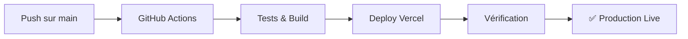

# 🔗 Configuration GitHub ↔️ Vercel - Déploiement Automatique

## 📋 Vue d'ensemble

Ce guide explique comment configurer le déploiement automatique de SwapBack sur Vercel via GitHub Actions.

**Résultat** : Chaque push sur `main` déclenchera automatiquement un déploiement en production.

---

## 🔑 Étape 1 : Obtenir le Token Vercel

### 1.1 Créer un token d'accès Vercel

1. **Accéder à la page des tokens** :
   - URL : https://vercel.com/account/tokens
   - Ou : Dashboard Vercel → Settings → Tokens

2. **Créer un nouveau token** :
   - Cliquer sur **"Create Token"**
   - **Name** : `SwapBack GitHub Actions`
   - **Scope** : `Full Account` (ou sélectionner uniquement le projet SwapBack)
   - **Expiration** : `No Expiration` (recommandé pour CI/CD)

3. **Copier le token** :
   - ⚠️ **IMPORTANT** : Copiez le token immédiatement, il ne sera plus visible après
   - Format : `vercel_xxxxxxxxxxxxxxxxxxxxxxxxxxxxx`

### 1.2 Récupérer les IDs de projet

Les IDs sont déjà disponibles dans `.vercel/project.json` :

```json
{
  "projectId": "prj_OxtGifRcuC4hU9x2r2Wbg89ap0Ir",
  "orgId": "team_yvcPXxh5OyD9bGT9ogPgtNEw"
}
```

---

## 🔐 Étape 2 : Configurer les Secrets GitHub

### 2.1 Accéder aux secrets du repository

1. **Aller sur GitHub** :
   - URL : https://github.com/BacBacta/SwapBack/settings/secrets/actions
   - Ou : Repository → Settings → Secrets and variables → Actions

2. **Créer les 3 secrets suivants** :

### Secret 1 : `VERCEL_TOKEN`
- Cliquer sur **"New repository secret"**
- **Name** : `VERCEL_TOKEN`
- **Value** : Le token copié à l'étape 1.1 (commence par `vercel_`)
- Cliquer sur **"Add secret"**

### Secret 2 : `VERCEL_ORG_ID`
- **Name** : `VERCEL_ORG_ID`
- **Value** : `team_yvcPXxh5OyD9bGT9ogPgtNEw`
- Cliquer sur **"Add secret"**

### Secret 3 : `VERCEL_PROJECT_ID`
- **Name** : `VERCEL_PROJECT_ID`
- **Value** : `prj_OxtGifRcuC4hU9x2r2Wbg89ap0Ir`
- Cliquer sur **"Add secret"**

### 2.2 Vérification des secrets

Après ajout, vous devriez voir 3 secrets :
```
VERCEL_TOKEN          ••••••••
VERCEL_ORG_ID         ••••••••
VERCEL_PROJECT_ID     ••••••••
```

---

## 🚀 Étape 3 : Déclencher le Déploiement

### Option A : Push sur main (Automatique)

Tout push sur la branche `main` déclenche le workflow `main-ci.yml` qui inclut le déploiement Vercel.

```bash
# Faire un changement et pusher
git add .
git commit -m "chore: configure GitHub Vercel integration"
git push origin main
```

### Option B : Créer une Release (Recommandé pour Production)

Le workflow `release-deploy.yml` offre un déploiement complet avec vérifications :

```bash
# Créer un tag de release
git tag -a v1.0.0-beta -m "Beta Release - SwapBack DEX"
git push origin v1.0.0-beta

# Créer la release sur GitHub
# https://github.com/BacBacta/SwapBack/releases/new
# - Tag: v1.0.0-beta
# - Title: "SwapBack v1.0.0 Beta"
# - Description: "First beta release with full features"
# - Cliquer "Publish release"
```

### Option C : Déploiement Manuel via GitHub Actions

1. **Accéder à l'onglet Actions** :
   - URL : https://github.com/BacBacta/SwapBack/actions/workflows/release-deploy.yml

2. **Cliquer sur "Run workflow"** :
   - Branch : `main`
   - Environment : `production`
   - Cliquer sur **"Run workflow"**

---

## 📊 Étape 4 : Surveiller le Déploiement

### 4.1 Suivre le workflow GitHub

1. **Accéder à l'onglet Actions** :
   - URL : https://github.com/BacBacta/SwapBack/actions

2. **Sélectionner le workflow en cours** :
   - Vous verrez les jobs en temps réel :
     - ✅ Pre-Deployment Checks
     - ✅ Build Production
     - ✅ Build Programs (Verifiable)
     - 🚀 Deploy to Vercel
     - ✅ Post-Deployment Verification
     - 📢 Deployment Notification

### 4.2 Vérifier le déploiement Vercel

1. **Dashboard Vercel** :
   - URL : https://vercel.com/bactas-projects/swapback
   - Vérifier que le déploiement est en cours

2. **URL de production** :
   - https://swapback.vercel.app
   - Attendre la fin du déploiement (~2-3 minutes)

---

## ✅ Étape 5 : Configuration des Variables d'Environnement

### 5.1 Variables requises pour Production

Sur Vercel Dashboard → SwapBack → Settings → Environment Variables :

| Variable | Valeur | Description |
|----------|--------|-------------|
| `NEXT_PUBLIC_NETWORK` | `mainnet-beta` | Réseau Solana |
| `NEXT_PUBLIC_RPC_ENDPOINT` | `https://api.mainnet-beta.solana.com` | Endpoint RPC principal |
| `NEXT_PUBLIC_HELIUS_API_KEY` | `<votre_clé>` | Clé API Helius |
| `NEXT_PUBLIC_SWAP_BACK_PROGRAM_ID` | `<program_id>` | ID du programme SwapBack |
| `NEXT_PUBLIC_DCA_PROGRAM_ID` | `<program_id>` | ID du programme DCA |

### 5.2 Variables optionnelles

| Variable | Valeur | Description |
|----------|--------|-------------|
| `NEXT_PUBLIC_ENABLE_BETA` | `true` | Activer le programme beta |
| `NEXT_PUBLIC_SENTRY_DSN` | `<dsn>` | Monitoring Sentry |
| `NEXT_PUBLIC_ANALYTICS_ID` | `<id>` | Google Analytics |

---

## 🔄 Workflow de Déploiement Automatique



### Déclencheurs automatiques :

1. **Push sur `main`** → `main-ci.yml` → Déploiement automatique
2. **Pull Request mergé** → Tests passent → `main-ci.yml`
3. **Release créée** → `release-deploy.yml` → Déploiement complet avec vérifications

---

## 🛠️ Dépannage

### Problème : "VERCEL_TOKEN not found"

**Cause** : Le secret n'est pas configuré ou mal nommé.

**Solution** :
1. Vérifier que le secret existe : https://github.com/BacBacta/SwapBack/settings/secrets/actions
2. Vérifier l'orthographe exacte : `VERCEL_TOKEN` (sensible à la casse)
3. Recréer le secret si nécessaire

### Problème : "Project not found"

**Cause** : `VERCEL_PROJECT_ID` ou `VERCEL_ORG_ID` incorrect.

**Solution** :
1. Vérifier `.vercel/project.json` :
   ```bash
   cat /workspaces/SwapBack/app/.vercel/project.json
   ```
2. Mettre à jour les secrets GitHub avec les bonnes valeurs

### Problème : "Deployment failed"

**Cause** : Erreur de build ou tests échoués.

**Solution** :
1. Vérifier les logs GitHub Actions
2. Tester le build localement :
   ```bash
   cd /workspaces/SwapBack/app
   npm run build
   ```
3. Corriger les erreurs et pusher à nouveau

### Problème : "Permission denied"

**Cause** : Token Vercel sans permissions suffisantes.

**Solution** :
1. Créer un nouveau token avec scope `Full Account`
2. Mettre à jour le secret `VERCEL_TOKEN` sur GitHub

---

## 📚 Ressources

- **GitHub Actions** : https://docs.github.com/en/actions
- **Vercel Deployment** : https://vercel.com/docs/deployments
- **Vercel CLI** : https://vercel.com/docs/cli
- **GitHub Secrets** : https://docs.github.com/en/actions/security-guides/encrypted-secrets

---

## 🎯 Prochaines Étapes

Après la configuration :

1. ✅ **Tester le déploiement** :
   - Faire un petit commit
   - Vérifier que le workflow se lance
   - Attendre le déploiement sur Vercel

2. ✅ **Configurer les variables d'environnement** :
   - Ajouter les clés API sur Vercel Dashboard
   - Redéployer pour appliquer les changements

3. ✅ **Lancer le programme beta** :
   - 50 codes d'invitation prêts dans `beta-invite-codes.csv`
   - Envoyer les emails de bienvenue
   - Surveiller les métriques dans le dashboard beta

4. ✅ **Monitoring production** :
   - Configurer Sentry pour les erreurs
   - Activer Vercel Analytics
   - Surveiller les performances

---

## ✨ Résultat Final

Une fois configuré, votre workflow de déploiement sera :

```
Développement → Commit → Push → Tests automatiques → Build → Deploy → Verification → Production ✅
```

**Temps total** : ~5-7 minutes du push au déploiement live ! 🚀
