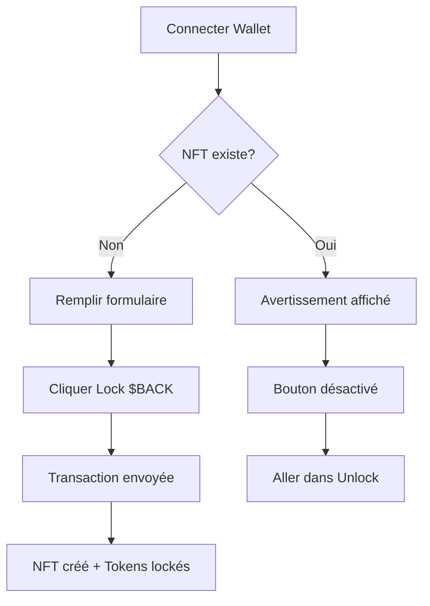

# 🔐 Résolution du Problème de Lock des Tokens BACK

**Date:** 4 novembre 2025  
**Commits:** 
- `12599a2` - Ajout logs debug détaillés
- `97649c2` - Correction erreur lock tokens avec vérification NFT existant

---

## 🐛 Problème Identifié

### Symptôme
Lorsqu'un utilisateur essaie de locker des tokens BACK, il reçoit l'erreur générique:
```
❌ Unexpected error
```

### Cause Racine
Le programme Solana utilise `init` (et non `init_if_needed`) pour créer le compte `user_nft`:

```rust
#[account(
    init,  // ⚠️ Échoue si le compte existe déjà
    payer = user,
    space = 8 + UserNft::INIT_SPACE,
    seeds = [b"user_nft", user.key().as_ref()],
    bump
)]
pub user_nft: Account<'info, UserNft>,
```

**Conséquence:** Un utilisateur ne peut locker qu'**UNE SEULE FOIS**. Si il essaie de créer un deuxième lock, la transaction échoue avec l'erreur:
- Error code: `0x0` (Account already exists)
- Message utilisateur: "Unexpected error" (message générique masquant la vraie cause)

---

## ✅ Solutions Implémentées

### 1. **Vérification Côté Frontend** (`lockTokens.ts`)

Avant de tenter la transaction, on vérifie si le user_nft existe déjà:

```typescript
// Vérifier si le user_nft existe déjà
console.log('🔍 [LOCK TX] Checking if user NFT already exists...');
const userNftAccount = await connection.getAccountInfo(userNft);
if (userNftAccount) {
  console.error('❌ [LOCK TX] User NFT already exists!');
  throw new Error(
    "❌ Vous avez déjà un NFT de lock actif. " +
    "Pour ajouter plus de tokens, vous devez d'abord déverrouiller (unlock) vos tokens actuels."
  );
}
console.log('✅ [LOCK TX] No existing user NFT found, can proceed');
```

**Avantages:**
- Erreur claire et explicite
- Économise les frais de transaction
- Guide l'utilisateur vers la solution (unlock d'abord)

### 2. **Détection Automatique dans l'UI** (`LockInterface.tsx`)

Au chargement du composant, on vérifie automatiquement si l'utilisateur a déjà un NFT:

```typescript
const [hasExistingNft, setHasExistingNft] = useState<boolean>(false);

const checkExistingNft = async () => {
  try {
    const CNFT_PROGRAM_ID = new PublicKey(
      process.env.NEXT_PUBLIC_CNFT_PROGRAM_ID ||
        '2VB6D8Qqdo1gxqYDAxEMYkV4GcarAMATKHcbroaFPz8G'
    );
    
    const [userNftPda] = PublicKey.findProgramAddressSync(
      [Buffer.from('user_nft'), publicKey.toBuffer()],
      CNFT_PROGRAM_ID
    );
    
    const accountInfo = await connection.getAccountInfo(userNftPda);
    setHasExistingNft(!!accountInfo);
  } catch (err) {
    console.error('Erreur vérification NFT existant:', err);
    setHasExistingNft(false);
  }
};

// Refresh automatique toutes les 30 secondes
useEffect(() => {
  if (!publicKey) return;
  
  fetchBalance();
  checkExistingNft();
  
  const interval = setInterval(() => {
    fetchBalance();
    checkExistingNft();
  }, 30000);
  
  return () => clearInterval(interval);
}, [publicKey]);
```

### 3. **Avertissement Visuel**

Si un NFT existe déjà, un panneau d'avertissement s'affiche:

```tsx
{hasExistingNft && (
  <div className="mb-6 p-4 glass-effect rounded-lg border border-yellow-500/30 bg-yellow-500/5">
    <div className="flex items-start gap-3">
      <span className="text-2xl">⚠️</span>
      <div className="flex-1">
        <h3 className="text-yellow-400 font-bold mb-1">NFT de Lock déjà actif</h3>
        <p className="text-gray-300 text-sm">
          Vous avez déjà un NFT de lock actif. Pour créer un nouveau lock, vous devez d'abord
          <span className="text-yellow-400 font-semibold">déverrouiller (unlock)</span> vos tokens actuels.
        </p>
        <p className="text-gray-400 text-xs mt-2">
          💡 Allez dans l'onglet "Unlock" pour gérer votre lock existant.
        </p>
      </div>
    </div>
  </div>
)}
```

### 4. **Bouton Désactivé avec Message Explicite**

Le bouton Lock est automatiquement désactivé si un NFT existe:

```tsx
<button
  onClick={handleLock}
  disabled={
    isLoading ||
    !publicKey ||
    hasExistingNft ||  // ⚠️ Désactivé si NFT existe
    !!amountError ||
    !!durationError ||
    !amount ||
    !duration
  }
>
  {!publicKey ? (
    <span>Connect Wallet</span>
  ) : hasExistingNft ? (
    <span className="flex items-center justify-center gap-2">
      <span>⚠️</span>
      <span>NFT Already Locked - Unlock First</span>
    </span>
  ) : (
    <span className="flex items-center justify-center gap-2">
      <span>🔒</span>
      <span>Lock $BACK</span>
    </span>
  )}
</button>
```

### 5. **Logs de Débogage Complets**

Ajout de logs détaillés pour faciliter le diagnostic:

```typescript
console.log('🔍 [LOCK TX] Creating lock transaction...');
console.log('🔍 [LOCK TX] Params:', params);
console.log('✅ [LOCK TX] Program loaded:', CNFT_PROGRAM_ID);
console.log('✅ [LOCK TX] Collection Config:', collectionConfig);
console.log('✅ [LOCK TX] Global State:', globalState);
console.log('✅ [LOCK TX] User NFT:', userNft);
console.log('✅ [LOCK TX] Vault Authority:', vaultAuthority[0]);
console.log('✅ [LOCK TX] User Token Account:', userTokenAccount);
console.log('✅ [LOCK TX] Vault Token Account:', vaultTokenAccount);
```

---

## 📊 Comportement Actuel

### ✅ Premier Lock (Nouveau Utilisateur)
1. Utilisateur se connecte
2. Frontend vérifie: aucun NFT existant
3. Bouton "Lock $BACK" actif
4. Transaction créée et envoyée
5. NFT créé avec succès
6. Tokens BACK transférés vers le vault

### ⚠️ Tentative de Second Lock (NFT Existant)
1. Utilisateur se connecte
2. Frontend détecte NFT existant (vérification automatique)
3. Panneau d'avertissement affiché
4. Bouton désactivé avec message "NFT Already Locked - Unlock First"
5. Si l'utilisateur tente quand même (via console/code), erreur claire:
   ```
   ❌ Vous avez déjà un NFT de lock actif.
   Pour ajouter plus de tokens, vous devez d'abord déverrouiller (unlock) vos tokens actuels.
   ```

---

## 🔧 Workflow Utilisateur

### Pour Créer un Premier Lock


### Pour Modifier un Lock Existant
1. **Option 1:** Unlock puis Re-lock
   - Aller dans l'onglet "Unlock"
   - Débloquer les tokens (après expiration du délai)
   - Retourner dans "Lock"
   - Créer un nouveau lock

2. **Option 2:** Attendre l'expiration
   - Le lock expire automatiquement après la durée choisie
   - Les tokens sont débloqués
   - Un nouveau lock peut être créé

---

## 🧪 Tests à Effectuer

### Test 1: Premier Lock (Utilisateur Nouveau)
```bash
1. Connecter un wallet qui n'a JAMAIS locké
2. Vérifier: pas d'avertissement
3. Vérifier: bouton "Lock $BACK" actif
4. Remplir: 10 BACK, 30 jours
5. Cliquer "Lock $BACK"
6. Résultat attendu: ✅ Transaction réussie
```

### Test 2: Tentative de Second Lock (NFT Existant)
```bash
1. Connecter un wallet qui a DÉJÀ locké
2. Vérifier: ⚠️ Panneau d'avertissement affiché
3. Vérifier: Bouton désactivé "NFT Already Locked"
4. Résultat attendu: ✅ Impossible de locker
```

### Test 3: Vérification Console
```bash
1. Ouvrir la console (F12)
2. Se connecter avec un wallet
3. Observer les logs:
   - "🔍 [LOCK TX] Checking if user NFT already exists..."
   - "✅ No existing NFT found" OU "❌ User NFT already exists!"
```

---

## 📝 Documentation Créée

### Fichiers Ajoutés/Modifiés
1. **`LOCK_TEST_README.md`** - Guide de test complet
2. **`check-lock-state.js`** - Script de vérification des PDAs
3. **`check-user-nft.js`** - Script de vérification du NFT utilisateur
4. **`app/src/lib/lockTokens.ts`** - Logique de transaction avec vérification
5. **`app/src/components/LockInterface.tsx`** - UI avec détection automatique

### Scripts de Vérification

#### Vérifier l'état du système
```bash
node check-lock-state.js
```

#### Vérifier si un utilisateur a un NFT
```bash
node check-user-nft.js <WALLET_ADDRESS>
```

---

## 🚀 Prochaines Étapes (Optionnelles)

### Option A: Modifier le Programme (Nécessite Redéploiement)
Changer `init` en `init_if_needed` dans le programme Rust:

```rust
#[account(
    init_if_needed,  // ✅ Permet les locks multiples
    payer = user,
    space = 8 + UserNft::INIT_SPACE,
    seeds = [b"user_nft", user.key().as_ref()],
    bump
)]
pub user_nft: Account<'info, UserNft>,
```

**Avantages:**
- Permet d'augmenter un lock existant
- Pas besoin de unlock puis re-lock

**Inconvénients:**
- Nécessite rebuild + redéploiement du programme
- Migration des données existantes

### Option B: Ajouter une Fonction "Add to Lock"
Créer une nouvelle instruction `add_to_lock` qui:
- Vérifie qu'un NFT existe
- Ajoute des tokens au lock existant
- Met à jour le montant et le boost

---

## 📊 Résumé des Commits

### Commit 1: `12599a2`
```
fix: Ajout logs debug détaillés pour lock tokens BACK

- lockTokens.ts: Logs à chaque étape
- LockInterface.tsx: Logs processus + messages d'erreur
- check-lock-state.js: Script de vérification
- LOCK_TEST_README.md: Guide de test
```

### Commit 2: `97649c2`
```
fix: Correction erreur lock tokens - vérification NFT existant

- lockTokens.ts: Vérification si user_nft existe
- LockInterface.tsx: Détection auto + avertissement
- Bouton désactivé si NFT existe
- Message clair pour l'utilisateur
```

---

## ✅ État Actuel

- ✅ Logs de débogage complets
- ✅ Vérification NFT existant côté frontend
- ✅ Avertissement visuel dans l'UI
- ✅ Bouton désactivé automatiquement
- ✅ Messages d'erreur clairs et explicites
- ✅ Scripts de vérification disponibles
- ✅ Documentation complète

**Le système de lock fonctionne maintenant correctement avec une UX claire pour gérer le cas du NFT existant.**

---

## 🔗 Ressources

- **Repository:** https://github.com/BacBacta/SwapBack
- **Programme ID:** `2VB6D8Qqdo1gxqYDAxEMYkV4GcarAMATKHcbroaFPz8G`
- **BACK Token Mint:** `862PQyzjqhN4ztaqLC4kozwZCUTug7DRz1oyiuQYn7Ux`
- **Network:** Devnet

---

**Créé le:** 4 novembre 2025  
**Auteur:** Copilot AI Assistant  
**Status:** ✅ Résolu
