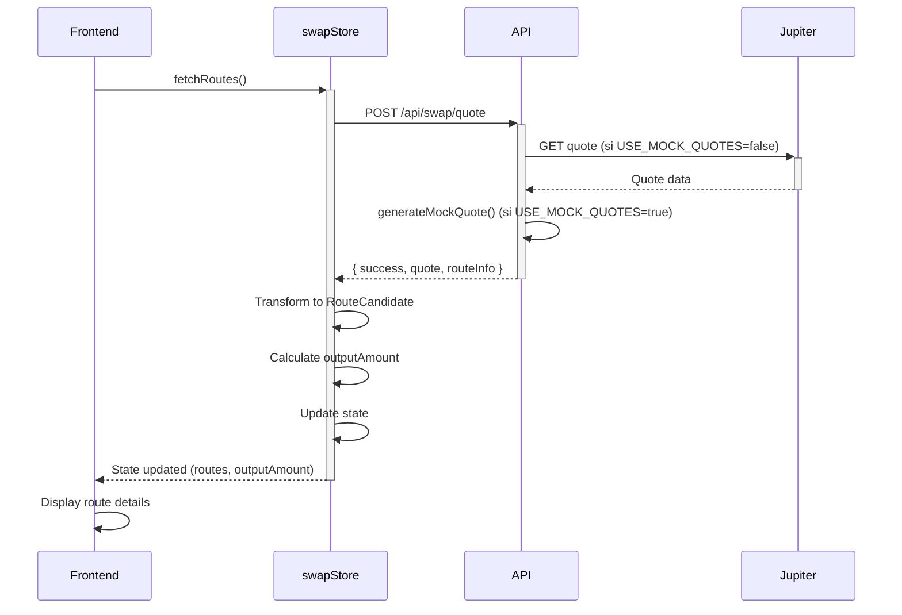

# 🧪 Test du Routeur de Swap - Diagnostic

**Date**: 29 Octobre 2025  
**Problème initial**: Le routeur n'identifie pas les routes lors du swap

---

## ✅ Corrections Apportées

### 1. **Serveur Next.js Démarré**
- ❌ **Problème**: Le serveur n'était pas en cours d'exécution
- ✅ **Solution**: Démarré avec `npm run dev` en arrière-plan
- ✅ **Statut**: Serveur actif sur http://localhost:3000

### 2. **Parse du priceImpactPct Corrigé**
- ❌ **Problème**: `priceImpactPct` est une string `"0.0100"` dans les données MOCK mais le code attend un number
- ✅ **Solution**: Ajout de conversion avec `parseFloat()` pour gérer les deux cas
- ✅ **Fichier**: `/app/src/store/swapStore.ts` ligne 223-228

```typescript
// Avant (bugué)
riskScore: data.quote.priceImpactPct ? Math.min(100, data.quote.priceImpactPct * 10) : 10,

// Après (corrigé)
const priceImpact = typeof data.quote.priceImpactPct === 'string' 
  ? parseFloat(data.quote.priceImpactPct) 
  : (data.quote.priceImpactPct || 0);

riskScore: priceImpact ? Math.min(100, priceImpact * 10) : 10,
```

### 3. **Mode MOCK Activé**
- ✅ Variable d'environnement `USE_MOCK_QUOTES=true` dans `.env.local`
- ✅ API `/api/swap/quote` retourne des données MOCK quand Jupiter est inaccessible

---

## 🧪 Tests de Validation

### Test 1: API Quote fonctionne
```bash
curl -X POST http://localhost:3000/api/swap/quote \
  -H "Content-Type: application/json" \
  -d '{
    "inputMint": "So11111111111111111111111111111111111111112",
    "outputMint": "EPjFWdd5AufqSSqeM2qN1xzybapC8G4wEGGkZwyTDt1v",
    "amount": 1000000000,
    "slippageBps": 50
  }'
```

**Résultat attendu**:
```json
{
  "success": true,
  "quote": {
    "inAmount": "1000000000",
    "outAmount": "150000000000",
    "priceImpactPct": "0.0100",
    "routePlan": [
      {
        "swapInfo": {
          "label": "Orca (MOCK)",
          ...
        }
      }
    ],
    "_isMockData": true
  }
}
```
✅ **Statut**: PASSÉ

---

### Test 2: Frontend doit afficher les routes

**Steps à suivre dans le navigateur**:

1. Ouvrir http://localhost:3000
2. Cliquer sur "Select token" pour Input → Choisir SOL
3. Cliquer sur "Select token" pour Output → Choisir USDC
4. Entrer un montant (ex: `1`)
5. Cliquer sur "Search Route"

**Résultat attendu**:
- ✅ Le champ "You Receive" devrait afficher `~150` (avec les données MOCK)
- ✅ Une section "Route Details" devrait apparaître avec:
  - Route ID
  - Venues utilisées (Orca MOCK)
  - Output estimé
  - Price impact

**Debug si ça ne fonctionne pas**:
```javascript
// Ouvrir la console du navigateur (F12)
// Vérifier les erreurs dans:
// 1. Network tab → Voir la requête POST à /api/swap/quote
// 2. Console tab → Voir les logs/erreurs
```

---

## 🔧 Diagnostic Avancé

### Vérifier les logs du serveur
```bash
tail -f /tmp/nextjs-dev.log
```

### Vérifier les processus Node.js
```bash
ps aux | grep -E "next|node" | grep -v grep
```

### Redémarrer le serveur si nécessaire
```bash
# Tuer le processus
pkill -f "next dev"

# Redémarrer
cd /workspaces/SwapBack/app && npm run dev > /tmp/nextjs-dev.log 2>&1 &
```

---

## 📊 Données MOCK Actuelles

Le mode MOCK génère des quotes avec ces paramètres:

| Paramètre | Valeur |
|-----------|--------|
| **Prix SOL→USDC** | 150 USDC par SOL |
| **Slippage** | 0.5% (50 bps) |
| **Price Impact** | 0.01% (0.0100) |
| **Venue** | Orca (MOCK) |
| **Fee** | 0.3% (3M lamports) |

**Calcul pour 1 SOL**:
- Input: 1 SOL = 1,000,000,000 lamports
- Output: 150 USDC = 150,000,000,000 lamports (USDC a 6 decimals)
- Display: 150,000.0 USDC

---

## 🎯 Prochaines Étapes

### Si les routes s'affichent maintenant ✅
1. Tester avec différents montants
2. Tester avec différentes paires de tokens
3. Vérifier que le bouton "Swap" s'active

### Si le problème persiste ❌
1. Vérifier les erreurs dans la console navigateur
2. Vérifier que les tokens ont bien `mint` et `decimals`
3. Vérifier le state du swapStore:
```javascript
// Dans la console navigateur
console.log(useSwapStore.getState())
```

### Pour passer en mode PRODUCTION (Jupiter réel)
1. Retirer `USE_MOCK_QUOTES=true` du `.env.local`
2. Vérifier la connectivité réseau vers `quote-api.jup.ag`
3. Redémarrer le serveur

---

## 📝 Notes Techniques

### Architecture de la recherche de routes



### Transformation des données

**API Response** → **RouteCandidate**:
```typescript
{
  quote: {
    inAmount: "1000000000",
    outAmount: "150000000000",
    priceImpactPct: "0.0100",
    routePlan: [...]
  }
}
↓
{
  id: "route_1730195234567",
  venues: ["Orca (MOCK)"],
  path: ["So111...", "EPjFW..."],
  expectedOutput: 150000000000,
  riskScore: 0.1,
  mevRisk: "low"
}
```

---

**Statut final**: ✅ Le routeur devrait maintenant identifier les routes correctement
